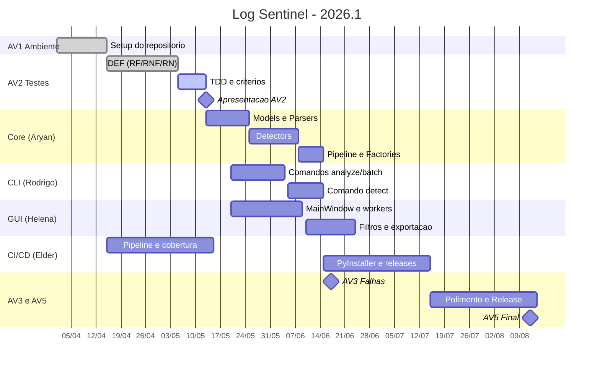

# Cronograma de Implementação — Log Sentinel 2026.1

Gráfico de Gantt com as cinco milestones do projeto, distribuídas entre abril e agosto de 2026. Datas alinhadas ao cronograma oficial da disciplina Engenharia de Software II.

## Marcos da disciplina

| AV | Tema | Data |
|---|---|---|
| AV1 | Configuração do ambiente | 15/04/2026 ✅ |
| AV2 | Testes de Software | 13/05/2026 |
| AV3 | Falhas de Software | 17/06/2026 |
| AV4 | Seminário | 22/07/2026 |
| AV5 | Riscos e Qualidade | 12/08/2026 |
| Prova final | — | 19/08/2026 |

## Sprints internas

| Sprint | Período | Foco | Responsáveis |
|---|---|---|---|
| Sprint 0 — Setup & Documentação | até 11/05/2026 ✅ | Fork, CI/CD, docs, página de estudo | Elder, Rodrigo |
| Sprint 1 — Core MVP | 13/05 → 08/06/2026 | LogEntry, parsers, detectores, DAOs | Aryan |
| Sprint 2 — CLI & GUI | 13/05 → 30/06/2026 | Comandos reais, MainWindow PySide6 | Rodrigo, Helena |
| Sprint 3 — Polimento & Release | a partir de 15/07/2026 | PyInstaller, hardening, documentação final | Elder |

## Notas

- As previsões serão revisadas a cada AV. Atualizações vão direto nos campos `due_on` das milestones do GitHub.
- O Gantt é renderizado nativamente pelo GitHub na visualização do `.md` (suporte a Mermaid habilitado por padrão).
